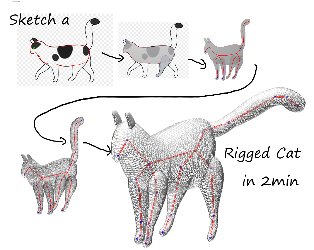

Short Bio
======
Hi, my name is Jing Ma (麻菁). I am a Ph.D. candidate at Zhejiang University in the computer science department supervised by [Prof. Dongliang Zhang](https://person.zju.edu.cn/en/0012126#0). I am interested in geometry processing, computational design and interactive technique. Currently, my research focus is to make 3D modeling & animation as easy as possible.

Education
======
- ZJU CS, Direct Doctorate, 2019 ~ Present
- PolyU EIE, 2018.9 ~ 2019.1
- NEU (BSc, Software Engineering, International Class) 2015 ~ 2019

Publications
======
 

&nbsp; __Real-time Skeletonization for Sketch-based Modeling__*[SMI 2021](https://smi2021.github.io/)* 
&nbsp;  Jing Ma, Jin Wang, Jituo Li, Dongliang Zhang  
&nbsp;  [paper](https://dl.acm.org/doi/abs/10.1016/j.cag.2021.11.005) | [paper](https://doi.org/10.1016/j.cag.2021.11.005) | [code](https://github.com/jingma-git/RealSkel)
<!--
&nbsp;  [arxiv](https://arxiv.org/pdf/2110.05805.pdf) | [acm](https://dl.acm.org/doi/abs/10.1016/j.cag.2021.11.005) | [paper](https://doi.org/10.1016/j.cag.2021.11.005) | [code](https://github.com/jingma-git/RealSkel)
 --> 
 
